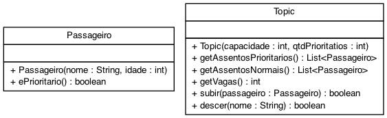

# Topic de Luxo (vetor de nulos, múltiplos vetores, métodos privados)


O objetivo dessa atividade é exercitar o que vocês aprenderam no cinema com algumas variações. Aqui, vamos implementar um sistema de alocação de passageiros em uma topic. Nossa topic tem uma quantidade máxima de passageiros, mas também define alguns assentos preferenciais.

- [Requisitos](#requisitos)
- [Shell](#shell)
- [Diagrama](#diagrama)
- [Esqueleto](#esqueleto)


***
## Requisitos
Seu sistema deverá:

- **[3.0 P] Inicializar e Mostrar.** 
    - Iniciar a topic solicitando a lotação máxima e a quantidade de cadeiras preferenciais.
	- Retorne um IllegalArgumentException caso haja mais assentos prioritários do que assentos na topic.
    - Mostrar o estado da topic
		- Coloque a quantidade de vagas disponível seguido de uma quebra de linha.
        - Coloque @ na frente das cadeiras preferenciais
        - Coloque = na frente das cadeiras normais.
	- Retornar a quantidade de vagas disponíveis.
- **[5.0 P] Inserir.** 
    - Inserir passageiros informando id e idade
        - Se o passageiro for idoso (Idade >= 65):
            - Se houver cadeiras preferenciais
                - O coloque na primeira cadeira preferência.
            - Senão
                - O coloque na primeira cadeira normal.
        - Se o passageiro não for idoso.
            - Se houver cadeiras não preferenciais
                - O coloque na primeira não preferencial.
            - Se não
                - O coloque na primeira cadeira preferencial.
- **[2.0 P] Remover.** 
    - Remover passageiros por id

Existe uma lista para as cadeiras normais e outra para as preferenciais. Para facilitar nas operações de busca e inserção, você deverá criar vários métodos privados para simplificar a lógica dos métodos principais.

## Diagrama



## Exemplo de execução
```java
public class Runner {

    public static void main(final String[] args) {

        Topic topic = new Topic(5, 2);
        System.out.println(topic.toString()); //[@ @ = = = ]

        Passageiro passageiro = new Passageiro("davi", 17);
        topic.subir(passageiro);
        System.out.println(topic); //[@ @ =davi = = ]

        passageiro = new Passageiro("joao", 103);
        topic.subir(passageiro);
        System.out.println(topic); //[@joao @ =davi = = ]
        passageiro = new Passageiro("ana", 35);
        topic.subir(passageiro);
        System.out.println(topic); //[@joao @ =davi =ana = ]

        passageiro = new Passageiro("rex", 20);
        topic.subir(passageiro);
        passageiro = new Passageiro("bia", 16);
        topic.subir(passageiro);
        System.out.println(topic); // [@joao @bia =davi =ana =rex ]

        topic.descer("davi");
        System.out.println(topic);
        passageiro = new Passageiro("aragao", 96);
        topic.subir(passageiro);
        System.out.println(topic); //[@joao @bia =aragao =ana =rex ]

        passageiro = new Passageiro("lucas", 23);
        if(!topic.subir(passageiro)){
            System.out.println("Topic lotada"); //Topic lotada
        }

        if(!topic.descer("marcelo")){
            System.out.println("Passageiro nao esta na topic"); //Passageiro nao esta na topic
        }

        topic.descer("ana");
        passageiro = new Passageiro("bia", 16);
        if(!topic.subir(passageiro)){
            System.out.println("Passageiro ja esta na topic"); //Passageiro ja esta na topic
        }
        System.out.println(topic); //[@joao @bia =aragao = =rex ]

    }
}

```


## Relatório de Entrega

Não esqueça de preencher o seguinte [formulário](https://forms.gle/xTkFeehZ2ocTctPu9) ao completar a atividade.
