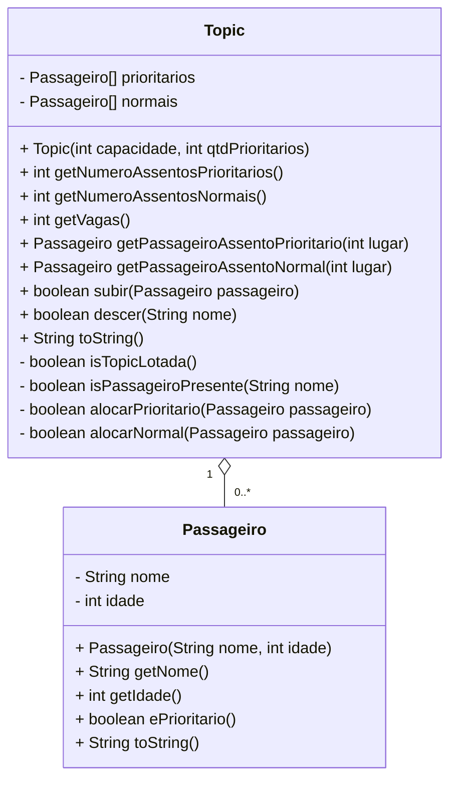

# Topic de Luxo (vetor de nulos, múltiplos vetores, métodos privados)


O objetivo dessa atividade é exercitar o que vocês aprenderam no cinema com algumas variações. Aqui, vamos implementar um sistema de alocação de passageiros em uma topic. Nossa topic tem uma quantidade máxima de passageiros, mas também define alguns assentos prioritários (preferenciais).

- [Requisitos](#requisitos)
- [Diagrama](#diagrama)
- [Exemplo de execução](#exemplo-de-execução)

***
## Requisitos
Seu sistema deverá:

- Inicializar
  - A topic deve ser inicializada com a quantidade total de assentos e a quantidade de assentos prioritários. Os demais assentos são normais.
    - Exemplo: `new Topic(5, 2)` cria 2 assentos prioritários e 3 normais.
  - Deve ser possível consultar a quantidade de assentos prioritários, a quantidade de assentos normais e a quantidade de vagas livres.

- Mostrar
  - Exiba primeiro os assentos prioritários e depois os normais, cada um seguido de um espaço, entre colchetes:
    - Assentos prioritários começam com `@`.
    - Assentos normais começam com `=`.
  - Se o assento está ocupado, mostre o nome e a idade do passageiro nele, no formato `nome:idade`.
    - Topic vazia: `[@ @ = = = ]`
    - Topic com passageiros: `[@joao:70 @bia:72 =davi:23 = =rex:39 ]`

- Subir (inserir) passageiro
  - O passageiro possui nome e idade.
  - O passageiro é prioritário se for idoso (idade ≥ 65).
  - Regras de alocação:
    - Passageiros prioritários:
      - Devem ser alocados no primeiro assento prioritário livre.
      - Caso não haja assentos prioritários livres, são alocados no primeiro assento normal livre.
    - Demais passageiros:
      - Devem ser alocados no primeiro assento normal livre.
      - Caso não haja assentos normais livres, são alocados no primeiro assento prioritário livre.
  - Não é possível subir se a topic estiver lotada ou se já houver um passageiro com o mesmo nome na topic (compare os nomes com `equals`, não com `==`). Nesses casos, `subir` retorna `false`; caso contrário, o passageiro é alocado e `subir` retorna `true`.

- Descer (remover) passageiro
  - O passageiro deve ser removido com base no nome.
  - O assento dele deve ficar vazio (`null`); os demais passageiros **não** mudam de lugar.
  - Caso o nome não exista na topic, `descer` retorna `false`; caso contrário, retorna `true`.

- Mensagens de feedback
  - Os métodos `subir` e `descer` não imprimem nada: eles retornam `true` ou `false`. Quem usa a topic (por exemplo, o `main`) é que exibe a mensagem adequada. Como `subir` retorna só `false`, quem chama pode usar `getVagas()` para saber se a topic estava lotada ou se o passageiro já estava nela:
    - Topic lotada, ao tentar subir: `Topic lotada`
    - Passageiro já está na topic, ao tentar subir: `Passageiro já está na topic`
    - Passageiro não está na topic, ao tentar descer: `Passageiro não está na topic`

Existe um vetor para os assentos prioritários e outro para os normais. Um assento vazio é representado por `null`. Para facilitar as operações de busca e inserção, você deverá criar vários métodos privados que simplifiquem a lógica dos métodos principais.

## Diagrama

```mermaid
classDiagram
    class Topic {
        - Passageiro[] prioritarios
        - Passageiro[] normais
        + Topic(int capacidade, int qtdPrioritarios)
        + int getNumeroAssentosPrioritarios()
        + int getNumeroAssentosNormais()
        + int getVagas()
        + Passageiro getPassageiroAssentoPrioritario(int lugar)
        + Passageiro getPassageiroAssentoNormal(int lugar)
        + boolean subir(Passageiro passageiro)
        + boolean descer(String nome)
        + String toString()
        - boolean isTopicLotada()
        - boolean isPassageiroPresente(String nome)
        - boolean alocarPrioritario(Passageiro passageiro)
        - boolean alocarNormal(Passageiro passageiro)
    }

    class Passageiro {
        - String nome
        - int idade
        + Passageiro(String nome, int idade)
        + String getNome()
        + int getIdade()
        + boolean ePrioritario()
        + String toString()
    }

    Topic "1" o-- "0..*" Passageiro
```

Observações:
- `getVagas()` retorna a quantidade de assentos livres (prioritários e normais).
- `getPassageiroAssentoPrioritario(lugar)` e `getPassageiroAssentoNormal(lugar)` retornam o passageiro na posição `lugar` (começando em 0) do respectivo vetor, ou `null` se o assento estiver vazio.
- `alocarPrioritario` e `alocarNormal` tentam colocar o passageiro no primeiro assento livre do respectivo vetor e retornam `false` se não houver assento livre.
- `toString()` de `Passageiro` retorna `nome:idade` (ex.: `ana:67`).

## Exemplo de execução
```java
public class Runner {

    public static void main(final String[] args) {

        Topic topic = new Topic(5, 2);
        System.out.println(topic); // [@ @ = = = ]

        Passageiro passageiro = new Passageiro("davi", 17);
        topic.subir(passageiro);
        System.out.println(topic); // [@ @ =davi:17 = = ]

        passageiro = new Passageiro("joao", 103);
        topic.subir(passageiro);
        System.out.println(topic); // [@joao:103 @ =davi:17 = = ]

        passageiro = new Passageiro("ana", 35);
        topic.subir(passageiro);
        System.out.println(topic); // [@joao:103 @ =davi:17 =ana:35 = ]

        passageiro = new Passageiro("rex", 20);
        topic.subir(passageiro);
        passageiro = new Passageiro("bia", 16); // assentos normais cheios: vai para o prioritário
        topic.subir(passageiro);
        System.out.println(topic); // [@joao:103 @bia:16 =davi:17 =ana:35 =rex:20 ]

        topic.descer("davi");
        System.out.println(topic); // [@joao:103 @bia:16 = =ana:35 =rex:20 ]

        passageiro = new Passageiro("aragao", 96); // prioritários cheios: vai para o normal
        topic.subir(passageiro);
        System.out.println(topic); // [@joao:103 @bia:16 =aragao:96 =ana:35 =rex:20 ]

        passageiro = new Passageiro("lucas", 23);
        if (!topic.subir(passageiro)) {
            System.out.println("Topic lotada"); // Topic lotada
        }

        if (!topic.descer("marcelo")) {
            System.out.println("Passageiro não está na topic"); // Passageiro não está na topic
        }

        topic.descer("ana");
        passageiro = new Passageiro("bia", 16);
        if (!topic.subir(passageiro)) {
            System.out.println("Passageiro já está na topic"); // Passageiro já está na topic
        }
        System.out.println(topic); // [@joao:103 @bia:16 =aragao:96 = =rex:20 ]
        System.out.println(topic.getVagas()); // 1
    }
}
```
